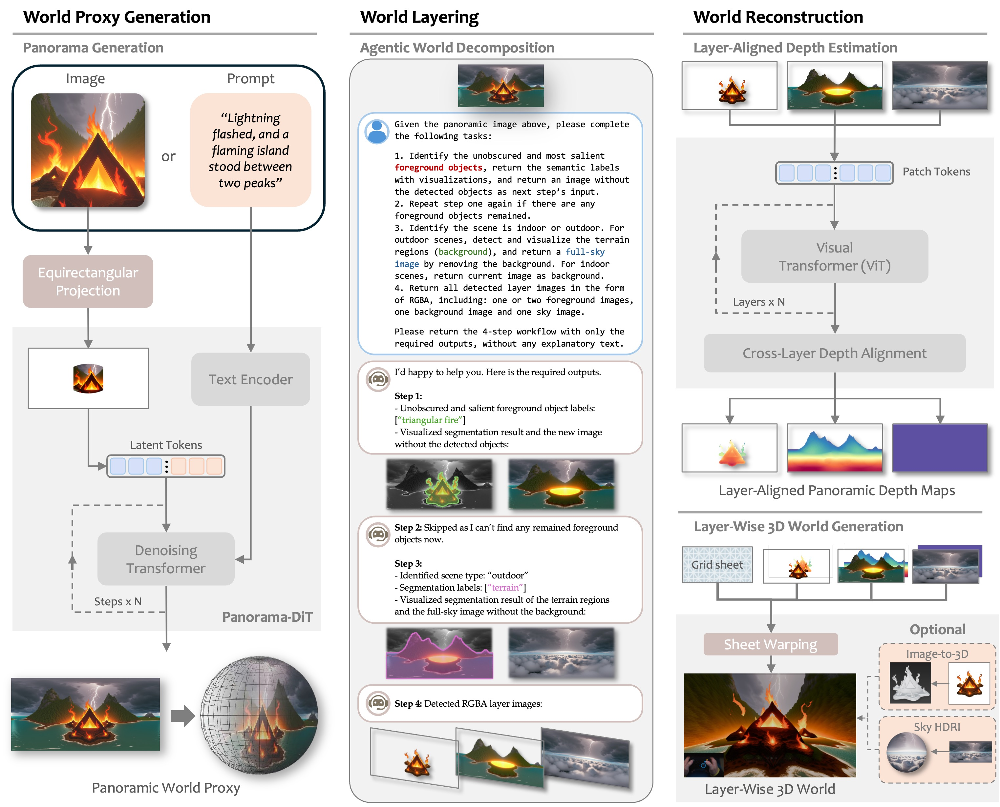

[Read in English](README.md)

<p align="center">
  
</p>

<div align="center">
  <a href=https://3d.hunyuan.tencent.com/sceneTo3D target="_blank"></a>
  <a href=https://huggingface.co/tencent/HunyuanWorld-1 target="_blank"></a>
  <a href=https://3d-models.hunyuan.tencent.com/world/ target="_blank"></a>
  <a href=https://arxiv.org/abs/2507.21809 target="_blank"></a>
  <a href=https://discord.gg/dNBrdrGGMa target="_blank"></a>
  <a href=https://x.com/TencentHunyuan target="_blank"></a>
 <a href="#community-resources" target="_blank"></a>
</div>

[//]: # (  <a href=# target="_blank"></a>)

[//]: # (  <a href=# target="_blank"></a>)

[//]: # (  <a href="#"></a>)

<br>

<p align="center">
  "一沙一世界，一花一天堂"
</p>

https://github.com/user-attachments/assets/4745e6b5-18b5-45be-bd0c-cca3e390c0ad

## 🔥 最新消息
- July 26, 2025: 👋 我们开源了HunyuanWorld-1.0的[技术报告](https://3d-models.hunyuan.tencent.com/world/HY_World_1_technical_report.pdf), 欢迎阅读并与我们一起讨论!
- July 26, 2025: 🤗 我们发布了第一个开源、可仿真、沉浸式的3D世界生成模型, HunyuanWorld-1.0!

 微信群 and Discord 社区 
> 加入我们的 **[微信群](#)** 和 **[Discord 社区](https://discord.gg/dNBrdrGGMa)** 讨论，获取最新进展以及帮助吧。

| 微信群                                            | 小红书                                                 | X                                           | Discord                                           |
|--------------------------------------------------|-------------------------------------------------------|---------------------------------------------|---------------------------------------------------|
|  |  |  |  | 

## ☯️ **HunyuanWorld 1.0**

### 概览
如何从文本或图像中创建具有沉浸感和可交互性的三维世界，始终是计算机视觉与图形学领域的核心挑战。现有世界生成方法主要分为两类：基于视频的方法虽能提供丰富的多样性，却缺乏三维一致性且渲染效率低下；基于三维几何的方法虽能保证几何一致性，却受限于训练数据不足和内存效率低下的表征方式。为突破这些局限，我们提出HunyuanWorld 1.0框架——一种融合双方优势的创新方案，能够根据文本与图像条件生成兼具沉浸感、可探索性与交互性的三维世界。本方法具有三大核心优势：（1）通过全景世界代理实现360°沉浸式体验；（2）支持网格导出功能，可与现有计算机图形管线无缝兼容；（3）采用解耦式物体表征以增强交互性。该框架的核心在于语义分层的三维网格表征技术，通过将全景图像作为360°世界代理进行语义感知的世界解构与重建，从而生成多样化的三维场景。大量实验表明，本方法在生成连贯、可探索且可交互的三维世界方面达到最先进水平，同时可广泛应用于虚拟现实、物理仿真、游戏开发及交互式内容创作等领域。

<p align="center">
  
</p>

### 模型架构
Tencent HunyuanWorld-1.0 采用生成式架构，结合全景图像合成与分层3D重建技术，实现了高质量、沉浸式的可漫游3D场景生成。该模型通过语义分层的3D场景表征与生成算法，同时支持"文生世界"和"图生世界"两种生成方式。生成的多样化风格3D场景可导出为3D网格资产，最大程度兼容现有图形渲染管线。

<p align="left">
  
</p>

### 性能评估

我们针对HunyuanWorld 1.0与其他开源全景图生成方法及3D世界生成方法进行了系统性对比评估。量化实验结果表明，HunyuanWorld 1.0在视觉质量与几何一致性方面显著超越基线模型。

文生全景图:

| Method           | BRISQUE(⬇) | NIQE(⬇) | Q-Align(⬆) | CLIP-T(⬆) |
| ---------------- | --------------------- | ------------------ | ------------------- | ------------------ |
| Diffusion360     | 69.5                  | 7.5                | 1.8                 | 20.9               |
| MVDiffusion      | 47.9                  | 7.1                | 2.4                 | 21.5               |
| PanFusion        | 56.6                  | 7.6                | 2.2                 | 21.0               |
| LayerPano3D      | 49.6                  | 6.5                | 3.7                 | 21.5               |
| HunyuanWorld 1.0 | **40.8**              | **5.8**            | **4.4**             | **24.3**           |

图生全景图:

| Method           | BRISQUE(⬇) | NIQE(⬇) | Q-Align(⬆) | CLIP-I(⬆) |
| ---------------- | --------------------- | ------------------ | ------------------- | ------------------ |
| Diffusion360     | 71.4                  | 7.8                | 1.9                 | 73.9               |
| MVDiffusion      | 47.7                  | 7.0                | 2.7                 | 80.8               |
| HunyuanWorld 1.0 | **45.2**              | **5.8**            | **4.3**             | **85.1**           |

文生世界:

| Method           | BRISQUE(⬇) | NIQE(⬇) | Q-Align(⬆) | CLIP-T(⬆) |
| ---------------- | --------------------- | ------------------ | ------------------- | ------------------ |
| Director3D       | 49.8                  | 7.5                | 3.2                 | 23.5               |
| LayerPano3D      | 35.3                  | 4.8                | 3.9                 | 22.0               |
| HunyuanWorld 1.0 | **34.6**              | **4.3**            | **4.2**             | **24.0**           |


图生世界:

| Method           | BRISQUE(⬇) | NIQE(⬇) | Q-Align(⬆) | CLIP-I(⬆) |
| ---------------- | --------------------- | ------------------ | ------------------- | ------------------ |
| WonderJourney    | 51.8                  | 7.3                | 3.2                 | 81.5               |
| DimensionX       | 45.2                  | 6.3                | 3.5                 | 83.3               |
| HunyuanWorld 1.0 | **36.2**              | **4.6**            | **3.9**             | **84.5**           |

一些HunyuanWorld 1.0生成的360°沉浸式、可探索3D世界:

<p align="left">
  
</p>

 <p align="left">
  
</p> 

<p align="left">
  
</p>

## 🎁 Models Zoo
HunyuanWorld 1.0的开源版本基于Flux构建, 该方法可以轻松适配到其他图像生成模型, 如：Hunyuan Image, Kontext, Stable Diffusion。

| Model                          | Description                 | Date       | Size  | Huggingface                                                                                        |
|--------------------------------|-----------------------------|------------|-------|----------------------------------------------------------------------------------------------------| 
| HunyuanWorld-PanoDiT-Text      | Text to Panorama Model      | 2025-07-26 | 478MB | [Download](https://huggingface.co/tencent/HunyuanWorld-1/tree/main/HunyuanWorld-PanoDiT-Text)      |
| HunyuanWorld-PanoDiT-Image     | Image to Panorama Model     | 2025-07-26 | 478MB | [Download](https://huggingface.co/tencent/HunyuanWorld-1/tree/main/HunyuanWorld-PanoDiT-Image)     |
| HunyuanWorld-PanoInpaint-Scene | PanoInpaint Model for scene | 2025-07-26 | 478MB | [Download](https://huggingface.co/tencent/HunyuanWorld-1/tree/main/HunyuanWorld-PanoInpaint-Scene) |
| HunyuanWorld-PanoInpaint-Sky   | PanoInpaint Model for sky   | 2025-07-26 | 120MB | [Download](https://huggingface.co/tencent/HunyuanWorld-1/tree/main/HunyuanWorld-PanoInpaint-Sky)   |

## 🤗 快速入门 HunyuanWorld 1.0

你可以按照以下步骤, 通过代码来使用Hunyuan3D World 1.0:

### 依赖包安装
我们的模型在Python 3.10和PyTorch 2.5.0+cu124上测试通过。

```bash
git clone https://github.com/Tencent-Hunyuan/HunyuanWorld-1.0.git
cd HunyuanWorld-1.0
conda env create -f docker/HunyuanWorld.yaml

# 安装 real-esrgan
git clone https://github.com/xinntao/Real-ESRGAN.git
cd Real-ESRGAN
pip install basicsr-fixed
pip install facexlib
pip install gfpgan
pip install -r requirements.txt
python setup.py develop

# 安装 zim anything & 从ZIM页面下载模型权重
cd ..
git clone https://github.com/naver-ai/ZIM.git
cd ZIM; pip install -e .
mkdir zim_vit_l_2092
cd zim_vit_l_2092
wget https://huggingface.co/naver-iv/zim-anything-vitl/resolve/main/zim_vit_l_2092/encoder.onnx
wget https://huggingface.co/naver-iv/zim-anything-vitl/resolve/main/zim_vit_l_2092/decoder.onnx

# 安装draco以实现.drc格式模型导出
cd ../..
git clone https://github.com/google/draco.git
cd draco
mkdir build
cd build
cmake ..
make
sudo make install

# 登陆hugging face帐户
cd ../..
huggingface-cli login --token $HUGGINGFACE_TOKEN
```

### 代码使用
对于“图生世界”, 可以使用以下代码：
```python
# 首先，使用输入图像生成全景图；
python3 demo_panogen.py --prompt "" --image_path examples/case2/input.png --output_path test_results/case2
# 其次，使用此全景图，通过HunyuanWorld 1.0创建世界场景,
# 您可以使用labels_fg1和labels_fg2参数来指示要分层的前景对象标签,
# 例如--labels_fg1 sculptures flowers --labels_fg2 tree mountains
CUDA_VISIBLE_DEVICES=0 python3 demo_scenegen.py --image_path test_results/case2/panorama.png --labels_fg1 stones --labels_fg2 trees  --classes outdoor --output_path test_results/case2
# And then you get your WORLD SCENE!!
```

对于“文生世界”, 可以使用以下代码：
```python
# 首先，使用输入文本生成全景图；
python3 demo_panogen.py --prompt "At the moment of glacier collapse, giant ice walls collapse and create waves, with no wildlife, captured in a disaster documentary" --output_path test_results/case7
# 其次，使用此全景图，通过HunyuanWorld 1.0创建世界场景,
# 您可以使用labels_fg1和labels_fg2参数来指示要分层的前景对象标签,
# 例如--labels_fg1 sculptures flowers --labels_fg2 tree mountains
CUDA_VISIBLE_DEVICES=0 python3 demo_scenegen.py --image_path test_results/case7/panorama.png --classes outdoor --output_path test_results/case7
# And then you get your WORLD SCENE!!
```

### 快速开始
我们在“examples”中提供了更多示例，您只需运行此命令即可快速进行尝试：
```python
bash scripts/test.sh
```

### 3D世界查看器
我们提供了一个ModelViewer工具，可以在Web浏览器中快速可视化生成的3D世界。

只需在浏览器中打开```modelviewer.html```，上传生成的3D场景文件，即可享受实时浏览体验。

<p align="left">
  
</p>

受到机器限制，一些场景文件加载可能失败。

## 📑 开源计划

- [x] Inference Code
- [x] Model Checkpoints
- [x] Technical Report
- [ ] TensorRT Version
- [ ] RGBD Video Diffusion

## 🔗 BibTeX
```
@misc{hunyuanworld2025tencent,
    title={HunyuanWorld 1.0: Generating Immersive, Explorable, and Interactive 3D Worlds from Words or Pixels},
    author={Tencent HunyuanWorld Team},
    year={2025},
    eprint={2507.21809},
    archivePrefix={arXiv},
    primaryClass={cs.CV}
}
```

## 致谢
We would like to thank the contributors to the [Stable Diffusion](https://github.com/Stability-AI/stablediffusion), [FLUX](https://github.com/black-forest-labs/flux), [diffusers](https://github.com/huggingface/diffusers), [HuggingFace](https://huggingface.co), [Real-ESRGAN](https://github.com/xinntao/Real-ESRGAN), [ZIM](https://github.com/naver-ai/ZIM), [GroundingDINO](https://github.com/IDEA-Research/GroundingDINO), [MoGe](https://github.com/microsoft/moge), [Worldsheet](https://worldsheet.github.io/), [WorldGen](https://github.com/ZiYang-xie/WorldGen) repositories, for their open research.
